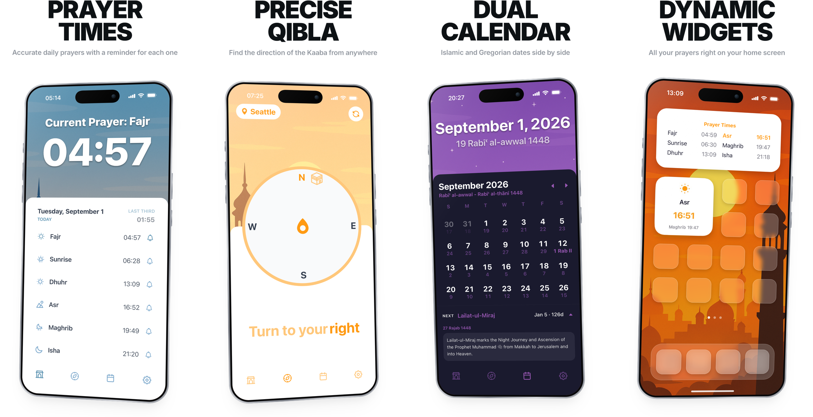

# Fardh: Islamic Prayer App

Cross-platform mobile app with real-time prayer time calculations supporting 24 calculation methods and dual juristic schools, currently undergoing final testing through Test Flight

<picture>
  <source media="(prefers-color-scheme: dark)" srcset="assets/images/github-repo/fardh-github-labelled-dark.png">
  <source media="(prefers-color-scheme: light)" srcset="assets/images/github-repo/fardh-github-labelled-light.png">
  
</picture>

## ✨ Features

* **Prayer Times & Islamic Calendar:** Fetches real-time data via the [Aladhan Prayer Times API](https://aladhan.com/prayer-times-api) and [Aladhan Islamic Calendar API](https://aladhan.com/islamic-calendar-api) to keep users updated with accurate prayer schedules and lunar dates.
* **Qibla:** Utilizes Expo's [Location API](https://docs.expo.dev/versions/latest/sdk/location/#api) alongside the [Aladhan Qibla API](https://aladhan.com/qibla-api) to provide precise Qibla direction.
* **Prayer Notifications:** Local push notifications using Expo's [Notifications API](https://docs.expo.dev/versions/latest/sdk/notifications/#api) to alert users of upcoming prayer times.
* **Home Screen Widgets:** Built with [Expo Apple Targets](https://github.com/EvanBacon/expo-apple-targets) and Apple's [WidgetKit Timeline](https://developer.apple.com/documentation/widgetkit/keeping-a-widget-up-to-date) to provide at-a-glance prayer information directly on the iOS home screen.

## 🛠️ Libraries and Frameworks Used

* **[React Native](https://reactnative.dev/docs/components-and-apis):** Core framework for cross-platform mobile development.
* **[Expo](https://docs.expo.dev/guides/overview/):** Toolchain and framework for accelerated React Native development.

* **[Bottom Tabs](https://reactnavigation.org/docs/bottom-tab-navigator):** For a simple and intuitive navigation experience.
* **[AsyncStorage](https://react-native-async-storage.github.io/3.0-next/api/usage/):** For caching essential user data and preferences locally.

* **[NativeWind](https://www.nativewind.dev/docs) & [CSS](https://developer.mozilla.org/en-US/docs/Web/CSS/Reference/Properties):** For utility-first styling and robust layout management.
* **[ReAnimated](https://docs.swmansion.com/react-native-reanimated/docs/category/fundamentals):** High-performance, fluid animations and transitions.

* **[React Native Reusables](https://reactnativereusables.com/docs):** Unstyled, accessible, and customizable components.
* **[RNUI (React Native UI Lib)](https://wix.github.io/react-native-ui-lib/docs/category/basic):** Comprehensive UI toolset and component library.

* **Design Assets:** UI/UX designed in **Figma**, featuring free line icons from **[IconScout](https://iconscout.com/unicons/free-line-icons)**.
